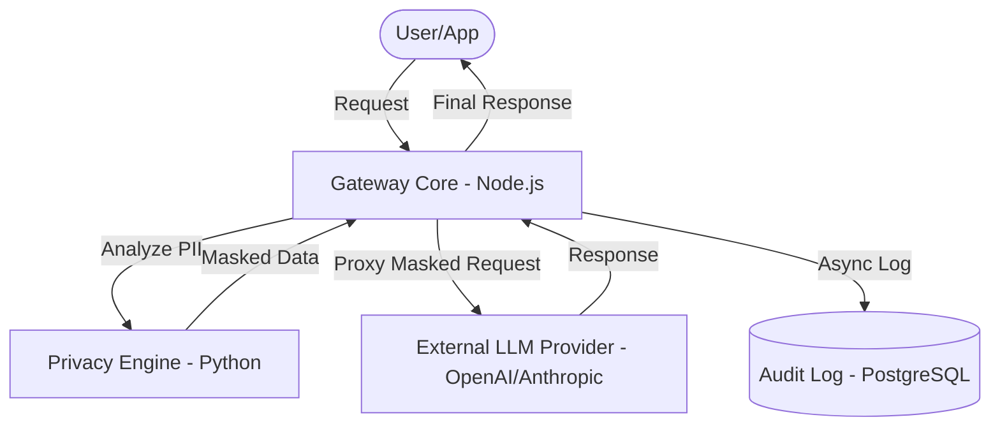

# GuardRail AI: Enterprise Secure LLM Gateway

**GuardRail AI**는 기업이 LLM(Large Language Models)을 안전하고 효율적으로 도입할 수 있도록 돕는 엔터프라이즈급 보안 게이트웨이입니다. **고성능 요청 처리, 실시간 데이터 거버넌스, 그리고 가시성(Observability)**에 초점을 맞추어 개발되었습니다.

## 🚀 Key Features

- **High-Performance Proxy**: Node.js(Fastify) 기반의 비동기 I/O 처리를 통해 지연 시간을 최소화하며 초당 수만 건의 요청을 안정적으로 중계합니다.
- **Privacy Shield (PII Masking)**: Microsoft Presidio 및 spaCy(NLP) 엔진을 활용하여 프롬프트 내의 이메일, 전화번호, 이름 등 민감한 개인정보(PII)를 실시간으로 탐지하고 마스킹합니다.
- **Asynchronous Audit Logging**: 모든 요청과 응답, 마스킹 이력을 PostgreSQL에 비동기로 기록하여 성능 저하 없이 완벽한 감사 추적(Audit Trail)을 보장합니다.
- **Enterprise-Ready Infrastructure**: Docker Compose를 통한 원클릭 서비스 오케스트레이션을 지원하며, 클라우드 네이티브 환경(K8s)으로의 확장이 용이합니다.

## 🛠 Tech Stack

- **Gateway Core**: Node.js, TypeScript, Fastify
- **Privacy Engine**: Python, FastAPI, Microsoft Presidio, spaCy
- **Database**: PostgreSQL, Prisma (ORM)
- **Infrastructure**: Docker, Docker Compose

## 🏗 Architecture



## 🚦 Getting Started

### Prerequisites
- Docker & Docker Compose
- OpenAI API Key (or other LLM providers)

### Installation & Run
1. 레포지토리를 클론합니다.
2. `gateway/.env` 파일을 생성하고 `OPENAI_API_KEY`를 설정합니다.
3. 서비스를 실행합니다:
   ```bash
   docker compose up -d
   ```
4. 게이트웨이가 `http://localhost:3002`에서 구동됩니다.

## 📊 Monitoring & Observability (Phase 4)

GuardRail AI는 시스템의 건강 상태와 보안 지표를 실시간으로 모니터링할 수 있는 환경을 제공합니다.

### 1. Dashboard (Grafana)
- **URL**: [http://localhost:3001](http://localhost:3001)
- **Login**: `admin` / `admin`
- **Setup**:
  1. `Connections` -> `Data Sources`에서 `Add data source` 클릭
  2. `Prometheus` 선택 후 URL에 `http://prometheus:9090` 입력
  3. `Save & Test` 클릭하여 연결 확인

### 2. Metrics (Prometheus)
- **URL**: [http://localhost:9090](http://localhost:9090)
- **Key Metrics**:
  - `pii_entities_detected_total`: 실시간 PII 탐지 및 마스킹 누적 횟수
  - `llm_request_duration_ms`: LLM 요청 지연 시간 (Histogram)
  - `http_requests_total`: 게이트웨이 전체 트래픽 현황

## 📈 Roadmap

- [x] Phase 1: Core Setup (Fastify + FastAPI)
- [x] Phase 2: Real PII Masking with Presidio
- [x] Phase 3: Asynchronous Audit Logging with Prisma
- [x] Phase 4: Dashboard & Statistics Visualization (Grafana)
- [x] Phase 5: RBAC & API Key Management
- [x] Phase 6: Semantic Caching with Vector DB

## 📄 License
This project is licensed under the MIT License.
