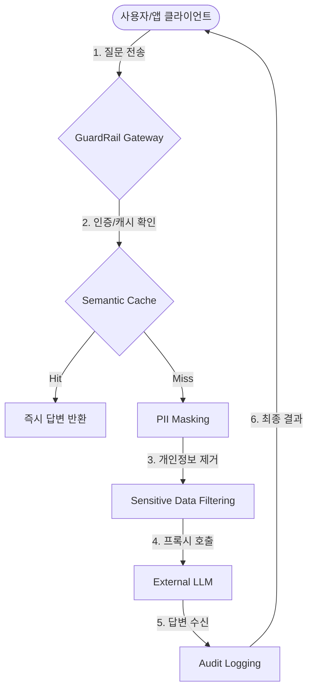

# 📖 GuardRail AI User & Integration Guide

이 문서는 사용자와 개발자가 GuardRail AI를 도입했을 때 요청이 어떻게 처리되는지, 그리고 어떤 가치를 얻을 수 있는지 설명합니다.

## 🌊 서비스 처리 흐름 (Request Flow)

GuardRail AI는 사용자로부터 받은 프롬프트를 외부 LLM으로 보내기 전, **보안(Security)**과 **성능(Performance)** 레이어를 거쳐 최적화합니다.



---

## 💎 주요 기능 및 도입 효과

### 1. 지능형 보안 (Data Governance)
- **PII Masking**: 이름, 이메일, 전화번호 등 개인정보를 실시간으로 감지하여 외부 유출을 차단합니다.
- **Audit Trail**: 모든 요청에 Trace ID를 부여하여, 어떤 사용자가 어떤 데이터를 다루었는지 완벽하게 추적합니다.

### 2. 초고속 성능 (Performance Acceleration)
- **Semantic Caching**: 이전과 유사한 질문이 들어오면 LLM을 거치지 않고 Vector DB에서 즉시 답변합니다.
- **Latency Reduction**: 캐시 히트 시 응답 속도가 최대 90%까지 향상됩니다.

### 3. 장애 대응 (Operational Excellence)
- **Unified Observability**: Metrics, Logging, Tracing이 하나로 연결되어 시스템 장애 시 원인을 즉시 파악할 수 있습니다.

---

## 🚀 시작하기 (API 호출 예시)

클라이언트는 기존 OpenAI SDK나 HTTP 클라이언트를 그대로 사용하되, 주소와 헤더만 변경하면 됩니다.

**Endpoint**: `POST http://localhost:3002/v1/chat/completions`  
**Header**: `x-api-key: test-key-123`

```bash
curl http://localhost:3002/v1/chat/completions \
  -H "Content-Type: application/json" \
  -H "x-api-key: test-key-123" \
  -d '{
    "model": "gpt-3.5-turbo",
    "messages": [{"role": "user", "content": "My email is test@example.com"}]
  }'
```
